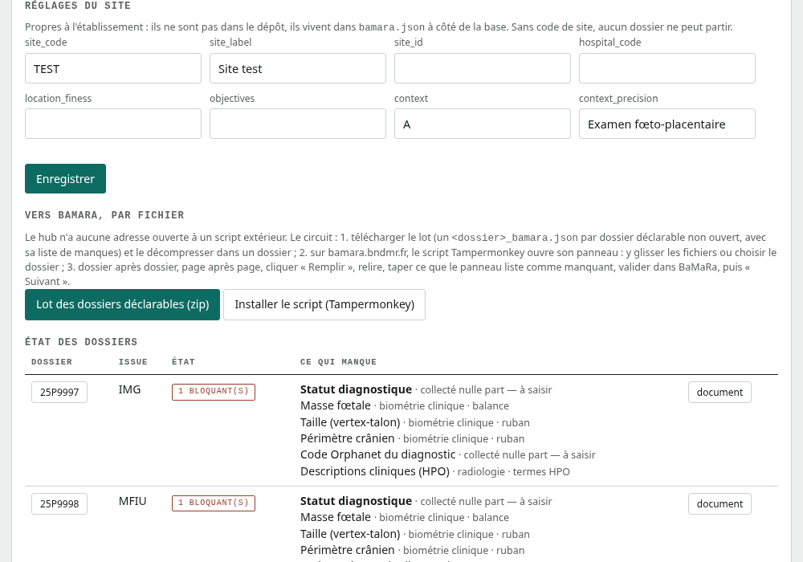
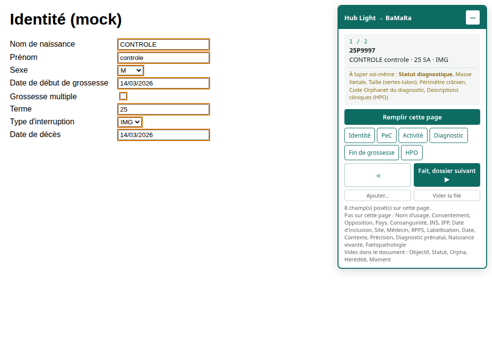

# Hub Light — manuel d'utilisation

Tous les cas montrés ici sont fictifs (`26P0123`, opérateur `AB`).

## 1. Ouvrir un module

Télécharger le fichier `.html` voulu (ou `pack_telephone.zip`, qui réunit les
six modules de salle), l'ouvrir par double-clic. Aucun serveur,
aucun réseau, aucun compte. Le module fonctionne dans Chrome, Edge, Firefox et
Safari récents ; sur tablette aussi.

Tout ce qui est saisi reste dans le navigateur de l'appareil (IndexedDB) ;
rien n'est transmis. Le résultat sort sous forme d'un fichier JSON à récupérer
à la main (clé USB, dossier partagé, messagerie du service).

## 2. Déverrouiller la saisie

À l'ouverture, seule la section **01 Dossier** est active. Le reste est grisé.

Deux champs déverrouillent le module :

- **Numéro de dossier** — texte libre, les lettres tapées passent
  automatiquement en majuscules et les espaces sont retirés (`25p9999` devient
  `25P9999`). Aucun format n'est imposé. Il donne son nom au fichier exporté :
  `26P0123_examen_clinique.json`.
- **Opérateur / Lecteur** — initiales, consignées dans l'export.

Dès que les deux sont renseignés, les sections suivantes s'allument et
l'enregistrement local démarre.

Les grilles de lecture microscopique demandent en plus le **terme en SA** :
c'est contre lui que la maturation est jugée.

## 3. Saisir

La règle est la même partout : **tout se clique**, seuls le dossier, les
comptes et les textes libres se tapent.

### Boutons-clics

Un bouton se coche d'un clic, se décoche d'un second. Un bouton vert plein est
coché. Sur les lignes « Présent / Absent », un seul des deux peut être actif.

Le compteur en haut à droite de chaque section (`3/9`) dit combien de choix
ont été faits sur le total : une section à `0/n` n'est pas « normale », elle
est **non regardée**.

### Verdicts

Sous chaque section des grilles, un encadré se recalcule à chaque clic :
recevabilité du prélèvement, borne inférieure de rétention, stade de
maturation attendu contre observé. Vert = cohérent, ambre = réserve,
rouge = incompatible. Il **affiche**, il ne se choisit pas.

### Signes et vocabulaire FOETO

Dans l'autopsie, l'examen clinique, la microscopie et les grilles, les signes
proposés viennent du vocabulaire FOETO. Un point discret après un libellé
signale un terme de la base. Le bouton « tous les signes attestés (n) » déroule
la liste complète ; le champ de recherche à 3 lettres la filtre.

### Clichés

Chaque cadre gris est un cliché à réaliser. Un clic ouvre l'appareil photo
(tablette) ou un sélecteur de fichier. Le cliché est conservé **en pleine
résolution** dans le stockage local et embarqué tel quel dans l'export ; la
vignette n'est qu'un affichage. Le bouton « + cliché + descriptif » ajoute un
cliché hors trame.

### Microscopie

`micro.html` s'ouvre sur une section vide qui propose les organes. On désigne
celui de la lame en main, la section prend son nom et pose ses axes ; « +
ajouter une section » ouvre la lame suivante. Un même organe peut revenir
autant de fois qu'il a de blocs, une section restée vide se retire.

## 4. Compte rendu

Les grilles de lecture composent un compte rendu texte à partir des clics.
Il se relit dans la section **Compte rendu**, un bouton le copie dans le
presse-papiers. La zone « Remarque libre » reçoit ce que la grille ne prévoit
pas ; elle part avec l'export.

## 5. Exporter, relire, effacer

- **Exporter le JSON** — écrit `<dossier>_<module>.json` dans le dossier de
  téléchargement. Actif seulement quand dossier et opérateur sont saisis.
- **Relire un JSON** — recharge un export précédent dans le module, pour
  compléter ou corriger. Le dossier et l'opérateur sont repris du fichier.
- **Vider / Effacer le stockage** — supprime tout ce que ce module a enregistré
  dans le navigateur de l'appareil. À faire une fois l'export récupéré.

Le JSON porte deux numéros : `module_version` (le formulaire) et
`schema_version` (la forme du fichier, celle que lit le script d'import).

## 6. Vérifier un module

Ajouter `?selftest=1` à l'adresse du fichier : un bandeau vert `OK : n/n`
s'affiche en haut de page. Rouge, ne pas s'en servir et le signaler.

La section **Diagnostic** en bas de page dit comment le fichier est ouvert,
si IndexedDB fonctionne et si le stockage est persistant. « Non accordé »
signifie que le navigateur peut effacer les données locales s'il manque de
place : exporter sans attendre.

## 7. Le hub — reprendre les JSON sur l'ordinateur

Double-clic sur `serveur.bat` à la racine du dépôt : le serveur local démarre
et la page de gestion s'ouvre quelques secondes plus tard sur
<http://127.0.0.1:5005>. Il n'écoute que sur ce poste, sans compte : la
protection est celle de la session Windows. Saisir ses initiales en haut à
droite, elles sont recopiées dans chaque saisie faite depuis le hub.

1. Copier les JSON récupérés du téléphone dans `hub/arrivee/`, ou les glisser
   sur l'onglet **Ingestion**.
2. « Reprendre les saisies » : chaque fichier est archivé tel quel, horodaté,
   rangé en base, ses clichés reconstitués en JPEG. Le compte rendu s'affiche
   ligne par ligne ; ce qui n'est pas passé est dans `hub/rejets/` avec son
   motif.
3. L'onglet **Dossiers** liste les cas : modules reçus et manquants, statut,
   remarques. Tout se corrige dans le module, jamais en base : « Saisir /
   Rouvrir » ouvre le module positionné sur le numéro, avec un bouton
   *enregistrer au hub* ; la nouvelle saisie devient courante, l'ancienne est
   gardée.

Le numéro de dossier y est aussi libre que dans les modules (il devient un
nom de répertoire : lettres, chiffres, `. _ -`). Les onglets **Comptes
rendus**, **Statistiques**, **Contrôle qualité** et **Sauvegarde** sont
décrits dans [hub/README.md](../hub/README.md).

## 8. Biblio — fiches, familles, akinator hors ligne

1. Télécharger `data_hub_vN.zip` sur
   [data.pazuzu.uk/browse/scripts](https://data.pazuzu.uk/browse/scripts).
2. Le glisser dans l'onglet **Biblio** (ou le poser dans `hub/arrivee/`). Le
   hub vérifie le manifest et l'empreinte de chaque fichier, garde le zip en
   archive et remplace le paquet précédent en entier.
3. Quatre vues : **Fiches micro** (les fiches de lecture par organe, celles
   dont sortent les grilles), **Familles** (familles de syndromes fœtaux :
   membres, signes cœur / partiels / discriminants, parenté), **Akinator**
   (diagnostic syndromique bayésien sur la matrice attestée par les livres +
   termes FOETO — saisir deux signes, répondre aux questions discriminantes),
   **Paquet** (version, sources, empreintes).

Un nouveau paquet se dépose de la même façon ; la version affichée est celle
du manifest.

Pour confronter des syndromes entre eux (signes communs, cousins dans l'arbre
HPO, gènes, dendrogramme), le comparateur est en ligne :
<https://data.pazuzu.uk/browse/comparer>.

## 9. BaMaRa — par fichier, jamais par réseau

Le hub prépare le document au format BaMaRa mais n'envoie rien et n'ouvre
aucune adresse à un script extérieur. Le seul transfert est un fichier que
l'opérateur déplace lui-même.

1. Onglet **BaMaRa** : renseigner une fois les réglages du site (code, libellé,
   FINESS…), gardés dans `hub/bamara.json`, hors dépôt.
2. « **Lot des dossiers déclarables (zip)** » : un `<dossier>_bamara.json` par
   dossier déclarable (IMG, ISG, MFIU, MPN, MNN, naissance vivante) non
   ouvert, chacun avec la liste de ce qui manque. Le décompresser dans un
   dossier. « document » sur une ligne fait la même chose pour un seul cas.
3. « **Installer le script** » : Tampermonkey l'installe. Il ne connaît pas le
   hub — ni adresse, ni requête.
4. Sur bamara.bndmr.fr, le panneau du script apparaît : glisser les fichiers
   ou choisir le dossier décompressé. La file survit aux changements de page.
5. Dossier après dossier : ouvrir le patient dans BaMaRa, « **Remplir cette
   page** » (ou une section), relire les champs surlignés, taper ce que le
   panneau liste « à taper soi-même » (le statut diagnostique, toujours),
   valider dans BaMaRa, puis « **Fait, dossier suivant** ». « HPO » copie les
   codes dans le presse-papiers.

Un libellé que le script ne trouve pas sur la page est listé « pas sur cette
page » : s'il devrait y être, c'est la ligne correspondante de `FIELD_MAP`
dans `BAMARA/bamara_fichier.user.js` qui est à corriger.

## 10. Ce qu'il ne faut pas faire

- Ne pas renommer le fichier `.html` : le nom du module entre dans le nom de
  l'export.
- Ne pas ouvrir deux fois le même module dans deux onglets sur le même
  dossier : les deux écriraient dans le même stockage.
- Ne pas compter sur le stockage local comme archive : l'export JSON est la
  seule copie qui survit à un nettoyage du navigateur.
- Ne pas corriger une saisie dans la base du hub : rouvrir le module, corriger,
  ré-enregistrer.
- Ne pas lier le serveur du hub à une autre adresse que `127.0.0.1` : il n'a
  pas d'authentification.
- Ne pas mettre `hub/` dans un dépôt ou un partage : `hub.sqlite`, `archive/`
  et `photos/` sont nominatifs. Seul `hub/app/` se partage.
